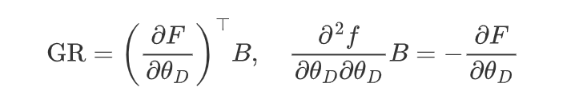
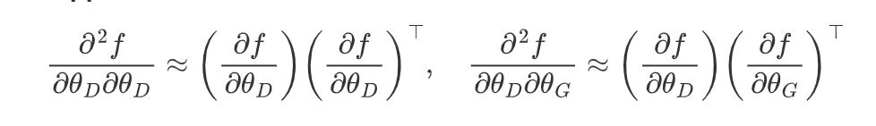

Dear Reviewer,

Thank you very much for your constructive comments and suggestions on our manuscript titled "BATTLE: Unsupervised Bi-Level Optimization with Implicit Relationship Mining for Attributed Graph Anomaly Detection" with Submission ID 732. We have carefully considered each point and have made significant revisions to address your concerns. Below, we provide a detailed response to your questions.

**Question 1 Respond:**

Thank you for your questions. Firstly, regarding the first point you mentioned about BATTLE's robustness to incoherent local structures or noise, we have addressed this in Section 4.4 "Ablation Study (RQ3)" of our paper. We appreciate your mention of the potential issue of incoherent local structures or noise, which is indeed present in relational graphs. However, we have demonstrated that incorporating implicit relationships is more effective than relying solely on explicit relationships, indicating that our BATTLE framework is robust against potential noise.

Our implicit relationship graph adds auxiliary edges to the original graph (which only contains explicit relationships) to represent the hidden, potential semantic relationships between entities. In other words, implicit relationships serve as auxiliary information, and we ultimately combine explicit and implicit relationships. In the experiments of Section 4.4, we designed three variants of BATTLE to compare their performance in anomaly detection tasks:

1. **BATTLE-Origin**: Uses only the original graph (i.e., explicit relationships) for anomaly detection.
2. **BATTLE-Mixed**: Uses both the original graph and the implicit relationship graph for anomaly detection.
3. **BATTLE-Implicit**: Uses only the implicit relationship graph for anomaly detection.

The results show that compared to BATTLE-Origin, BATTLE-Mixed improved the Precision@50 metric by 5.2% and 3.2% on two datasets, while BATTLE-Implicit improved the Precision@50 metric by 10% and 7.4% on the same two datasets. These results substantiate the effectiveness of constructing implicit edges. In other words, in response to the potential incoherent local structures or noise you mentioned, our BATTLE is indeed robust, as the inclusion of implicit relationships outperforms the original explicit relationships alone.

**Question 2 Respond:** 

We conducted experiments comparing BATTLE with other baselines regarding computational efficiency. As shown in Table 1, the experimental results demonstrate that BATTLE does not significantly increase training time compared to several other methods. However, we achieve notable performance improvement.

**Table 1:** Training time for different methods

| Methods       | BlogCatalog | Flickr    |
| ------------- | ----------- | --------- |
| ANEMONE(2021) | 10.07 min   | 22.40 min |
| CoLA(2022)    | 9.35 min    | 20.60 min |
| Sub-CR(2022)  | 10.90 min   | 23.62 min |
| BATTLE(Ours)  | 11.71 min   | 25.04 min |

The bi-level optimization method proposed in Section 3.3 can reduce the training time of BATTLE in the following ways:

1. **Explicit Dependency Modeling**: The bi-level optimization method models the dependencies between the upper-level task (implicit relationship mining) and the lower-level task (anomaly detection on attributed networks) explicitly, making the optimization process more direct and efficient. This approach can reduce unnecessary iterations because it allows the model to update parameters more precisely, reflecting the complex coupling between the two tasks.

2. **Parameter Update Strategy**: In bi-level optimization, by calculating the gradient of the best-response constraint (Best-Response Gradient), the model can update parameters more effectively. This strategy may reduce the number of iterations required in traditional optimization methods because it optimizes directly for the dependencies between the upper and lower tasks.

3. **Reducing Redundant Computations**: To address the high computational complexity in traditional bi-level optimization, BATTLE designs an implicit gradient scheme, combined with outer-product Hessian approximation as a fast solution strategy. This method avoids the explicit computation of the Hessian matrix and its inverse, thereby reducing computational load and training time. By using implicit gradient estimation (Implicit Gradient Estimation) and outer-product approximation (Outer-Product Approximation) methods, the BATTLE framework can simplify second-order derivatives to first-order derivatives, thus reducing computational complexity in the solution process. This approach can reduce the consumption of computational resources, potentially reducing training time.

   1. **Implicit Gradient Estimation**:
      
      
      
      Here, **GR** represents the hierarchical coupled-response gradient term, and **B** is a linear solution system used to avoid direct computation of the Hessian matrix and its inverse.

   2. **Outer-Product Approximation**:
      
      
      
      Here, by using outer-product approximation, the computation of second-order derivatives is simplified to the product of first-order derivatives.

These formulas demonstrate how implicit gradient estimation and outer-product approximation can simplify complex  second-order derivative computations, thereby reducing the complexity and memory consumption of the algorithm.

**Question 3 Respond:**

Thank you for your constructive feedback. The anomalies in the public datasets we used are indeed artificially introduced, and previous studies have validated their work using these datasets. To ensure the effectiveness of our BATTLE framework and the fairness of our experiments, we have chosen to continue using these widely adopted public datasets.

Your suggestion is very helpful; having examples from the real world would indeed provide stronger validation for our BATTLE framework. However, due to the current lack of publicly available real-world datasets, we are limited in this regard and have not been able to conduct such validations. We will consider this point in future work and attempt to incorporate more real-world examples for further validation.

We believe that these revisions have significantly improved the quality and clarity of our paper. We are confident that BATTLE provides a valuable contribution to the field and is worthy of presentation at WWW25.

Thank you once again for your thorough review and for giving us the opportunity to improve our work. We look forward to the possibility of presenting our research at WWW25.
